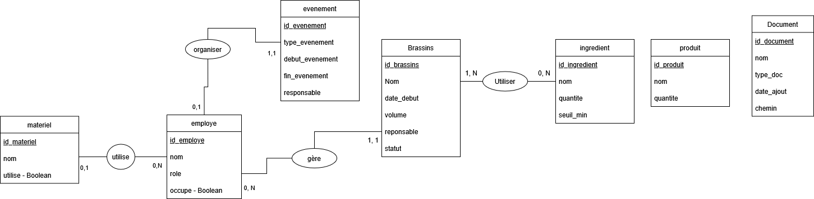
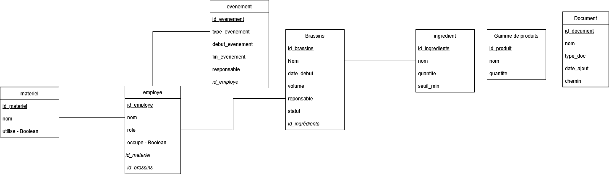
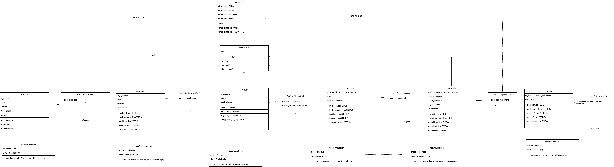
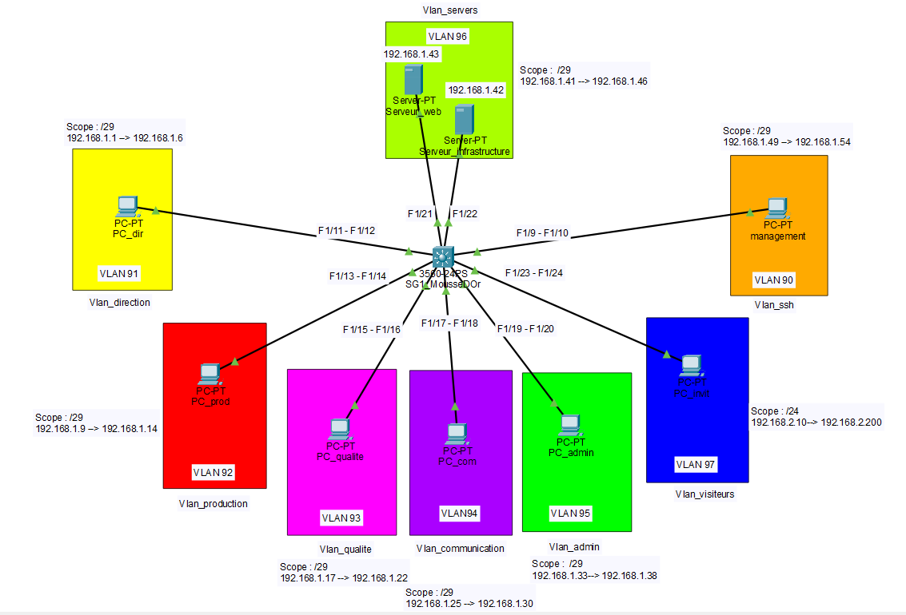

# Projet_Interdisciplinaire_G1 BAC 2 2025-2025

## Membres
- Hamza Aouraghe, Noa Di Nanno, Bastien Jonniaux, Cyril Denis

## Schéma UML

**Diagramme MCD**

**Diagramme MLD**

**Diagramme de classe**

## Schéma Topologie Réseau

